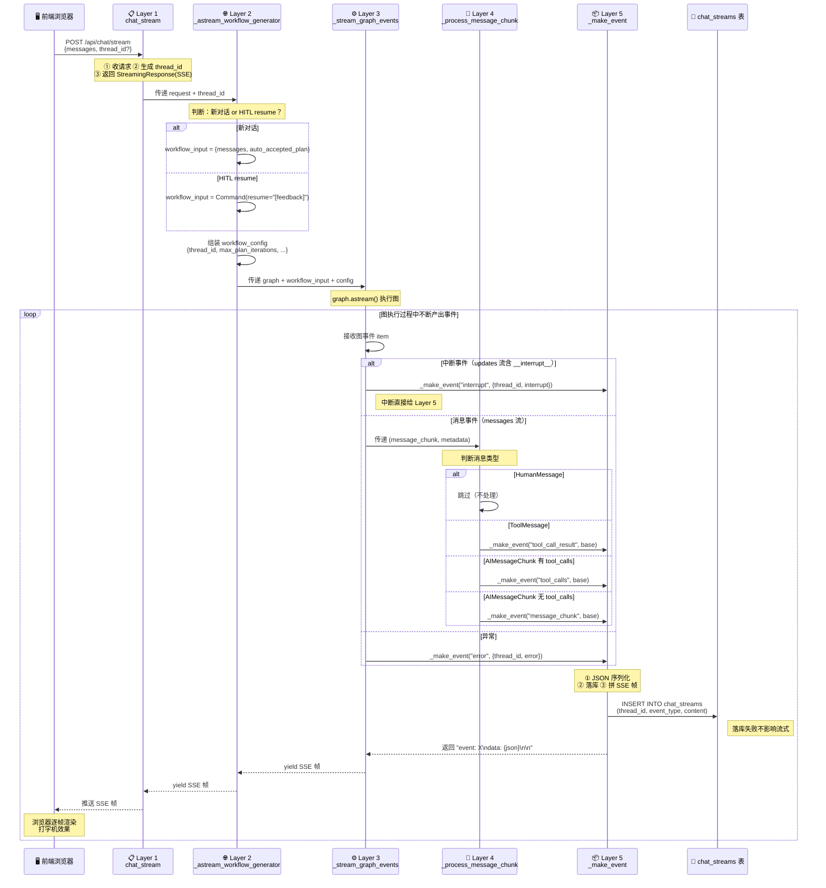

# SSE 五层调用链 — 通俗版总结
---

### 第一层 `chat_stream` — "前台接待"

> 代码位置：[server/app.py#L89-L97](file:///d:/code/python-code/DeepResearch/chapter-08/server/app.py#L89-L97)

前端发来一个请求，我这一层就是**前台接待**。我做三件事：

1. **收请求**：前端把用户的问题传给我
2. **发牌号**：如果没有 thread_id，我生成一个（`uuid4()`），这就是会话的"牌号"，保证不同用户的研究状态互不干扰
3. **声明协议**：我返回一个 `StreamingResponse`，告诉浏览器"我接下来按 SSE 协议给你推数据，你别等 JSON 了，边收边显示"

**我只管协议层面**——收数据、发牌号、声明格式。至于"问题怎么交给大模型"、"大模型的回答怎么变成流"，我不关心，那是下一层的事。

通俗讲：**你给我前端数据，下一层你要给我流式的回答数据（生成器）。**

---

### 第二层 `_astream_workflow_generator` — "翻译官"

> 代码位置：[server/app.py#L102-L141](file:///d:/code/python-code/DeepResearch/chapter-08/server/app.py#L102-L141)

我从第一层拿到了**前端的问题**和**线程id**。我的任务是把这些"翻译"成图能听懂的输入。

但翻译之前，我得先搞清楚一件事：**这是新对话，还是恢复对话？**

```
情况一：新对话（用户第一次提问）
┌──────────────────────────────────────────────────┐
│ 没有暂停的图等着我恢复                              │
│ → 直接把用户问题组装成 workflow_input              │
│   workflow_input = {                              │
│       "messages": 用户消息,                        │
│       "auto_accepted_plan": 是否自动接受计划        │
│   }                                               │
└──────────────────────────────────────────────────┘

情况二：恢复对话（HITL resume）
┌──────────────────────────────────────────────────┐
│ 上一轮大模型 interrupt 了，在等用户回答             │
│ 用户现在回答了，我需要恢复图的执行                  │
│ → 用 Command(resume="[用户的回答]") 恢复           │
│   workflow_input = Command(resume=f"[{feedback}]")│
└──────────────────────────────────────────────────┘
```

**为什么有两种情况？** 因为这个系统支持 HITL（人机协同）——大模型在执行过程中可能会暂停，问用户"这个研究计划行不行？"，用户回答后需要从暂停的地方继续，而不是重新开始。

除了 `workflow_input`，我还要组装 `workflow_config`（线程id、最大迭代次数、最大步骤数等配置）。

组装完输入后，**我不是就没事了**——我还要当"传话筒"：把下一层产出的事件流，逐个 `yield` 转发给第一层。

通俗讲：**我拿到问题，翻译成图能懂的输入，然后喊下一层"图你来执行"，你执行过程中产出的每个事件，我都转交给前台。**

---

### 第三层 `_stream_graph_events` — "执行引擎"

> 代码位置：[server/app.py#L146-L182](file:///d:/code/python-code/DeepResearch/chapter-08/server/app.py#L146-L182)

我从第二层拿到了**图的实例、图的输入、配置、线程id**。我的任务就是**让图跑起来**。

我调用 `graph.astream()`，图就开始执行了。图执行过程中会不断产出事件，我需要**区分两种事件**：

```
图执行中产出的事件
        │
        ├── 中断事件（interrupt）
        │   → updates 流产出的 dict 里有 __interrupt__
        │   → 说明图暂停了，在等用户审核
        │   → 直接交给第五层 _make_event 打成 SSE 帧
        │
        └── 消息事件（messages）
            → 产出的 tuple 是 (message_chunk, metadata)
            → 这是图节点的输出内容
            → 交给第四层 _process_message_chunk 处理
```

**我还要干一件事：异常兜底。** 图执行过程中如果出错了（比如 LLM 超时、工具报错），我不能让整个请求崩溃，而是捕获异常，转换成一个 `error` 事件，让前端知道"出错了"，而不是一直转圈等。

通俗讲：**我让图跑起来，图产出的事件我分拣——是中断就直接打包，是消息就交给下一层去细加工。出错了我也兜着，转成 error 事件。**

---

### 第四层 `_process_message_chunk` — "分拣员"

> 代码位置：[server/app.py#L187-L217](file:///d:/code/python-code/DeepResearch/chapter-08/server/app.py#L187-L217)

我从第三层拿到了**一个消息 chunk**（图节点的输出片段）。我的任务是**判断这是什么类型的事件，并提取出前端需要的字段**。

图产出的消息有三种类型，我分别处理：

```
消息 chunk 进来
    │
    ├── HumanMessage（用户消息）
    │   → 跳过，不处理（用户的消息前端已经显示了，不用回显）
    │
    ├── ToolMessage（工具返回结果）
    │   → 这是工具执行完的结果
    │   → 提取 tool_call_id + content
    │   → 标记成 "tool_call_result" 事件
    │
    └── AIMessageChunk（AI 输出）
        │
        ├── 有 tool_calls → AI 决定调用工具
        │   → 提取 tool_calls + content
        │   → 标记成 "tool_calls" 事件
        │
        └── 没有 tool_calls → AI 在输出文本（逐token）
            → 提取 content + finish_reason
            → 标记成 "message_chunk" 事件
```

**我只做"判断类型 + 提取字段"，不做格式化，也不碰数据库。** 我产出的是一个 `dict`（事件数据），至于这个 dict 怎么变成网络能传输的格式，那是下一层的事。

通俗讲：**我拿到图的一个输出片段，判断"这是AI在说话/在调工具/工具返回了结果"，贴上对应的标签，提取出关键字段，交给下一层去打包。**

---

### 第五层 `_make_event` — "打包发货 + 存档"

> 代码位置：[server/app.py#L222-L243](file:///d:/code/python-code/DeepResearch/chapter-08/server/app.py#L222-L243)

我从第四层（或第三层的中断分支）拿到了**事件类型 + 事件数据dict**。我的任务是**打包成 SSE 帧 + 存档**。

我做三件事：

1. **JSON 序列化**：把 dict 转成 JSON 字符串（序列化失败就兜底成 `{"error": "..."}`）
2. **存档落库**：每个 SSE 帧写一行到 `chat_streams` 表（这样刷新页面/重启服务后还能回看历史）
3. **拼 SSE 帧**：按协议格式拼成 `event: 类型\ndata: {json}\n\n`

```python
# 最终产出的就是一个字符串
f"event: {event_type}\ndata: {json_data}\n\n"
```

这个字符串就是最终通过网络发给浏览器的数据。浏览器收到后，按 SSE 协议解析，触发对应的渲染逻辑（打字机效果、工具调用卡片等）。

**落库失败不影响流式推送**——我用 `try/except` 包住落库逻辑，就算数据库挂了，SSE 帧还是会正常返回给前端，只是历史回放功能暂时不可用。

通俗讲：**你给我事件类型和数据，我帮你打包成网络能传的格式，顺便存一份到数据库（存失败了也不影响你收数据）。**

---

## 五层调用链流程图

### 图1：数据流全景（执行前 → 执行过程 → 执行后）

```
执行前（用户在输入框打字）：
┌──────────────────────────────────────────────────────┐
│  用户输入："光速是多少？"                              │
│  前端封装：ChatRequest { messages, thread_id?, ... }   │
└──────────────────────────────────────────────────────┘
                        │
                        ▼ POST /api/chat/stream
执行过程（五层链逐层处理）：
┌──────────────────────────────────────────────────────┐
│                                                       │
│  Layer 1: chat_stream（前台接待）                      │
│  ┌─────────────────────────────────────────────────┐ │
│  │ ① 收请求 ② 生成 thread_id ③ 返回 StreamingResponse│ │
│  │   media_type="text/event-stream"                  │ │
│  └──────────────────────┬──────────────────────────┘ │
│                         │ 传递 request + thread_id    │
│                         ▼                             │
│  Layer 2: _astream_workflow_generator（翻译官）       │
│  ┌─────────────────────────────────────────────────┐ │
│  │ ① 判断：新对话 or HITL resume？                  │ │
│  │    新对话 → workflow_input = {messages, ...}      │ │
│  │    恢复   → workflow_input = Command(resume=...)  │ │
│  │ ② 组装 workflow_config（thread_id, 限制参数）     │ │
│  │ ③ yield 转发下层事件给 Layer 1                    │ │
│  └──────────────────────┬──────────────────────────┘ │
│                         │ 传递 graph + input + config │
│                         ▼                             │
│  Layer 3: _stream_graph_events（执行引擎）            │
│  ┌─────────────────────────────────────────────────┐ │
│  │ ① graph.astream() 执行图                         │ │
│  │ ② 分拣事件：                                     │ │
│  │    interrupt → 直接给 Layer 5 ─────────────┐     │ │
│  │    messages  → 给 Layer 4 ───────┐         │     │ │
│  │ ③ 异常兜底 → error 事件给 Layer 5 │         │     │ │
│  └──────────────────────────────────│─────────│─────┘ │
│                                     ▼         │       │
│  Layer 4: _process_message_chunk（分拣员）     │       │
│  ┌─────────────────────────────────────────┐  │       │
│  │ 判断消息类型：                            │  │       │
│  │  HumanMessage  → 跳过                    │  │       │
│  │  ToolMessage   → "tool_call_result"      │  │       │
│  │  AIMessageChunk:                         │  │       │
│  │    有 tool_calls → "tool_calls"          │  │       │
│  │    无 tool_calls → "message_chunk"       │  │       │
│  │ 提取字段 → dict                          │  │       │
│  └──────────────────────┬──────────────────┘  │       │
│                         │ 传递 event_type+dict │       │
│                         ▼                     ▼       │
│  Layer 5: _make_event（打包发货 + 存档）               │
│  ┌─────────────────────────────────────────────────┐ │
│  │ ① JSON 序列化：dict → json 字符串                │ │
│  │ ② 落库：写 chat_streams 表（失败不影响流式）       │ │
│  │ ③ 拼 SSE 帧：event: X\ndata: {json}\n\n          │ │
│  └──────────────────────┬──────────────────────────┘ │
│                         │                             │
└─────────────────────────┼─────────────────────────────┘
                          │ yield SSE 帧字符串
                          ▼
执行后（浏览器收到并渲染）：
┌──────────────────────────────────────────────────────┐
│  event: message_chunk                                 │
│  data: {"thread_id":"abc","content":"光速是"}          │
│                                                       │
│  → 浏览器逐字渲染，打字机效果                          │
│  → 同时 chat_streams 表多了一行记录（可回放）          │
└──────────────────────────────────────────────────────┘
```

---

### 图2：Mermaid 时序图



---

## 一句话总结每层

| 层级 | 角色 | 通俗说法 |
|------|------|----------|
| **Layer 1** | 前台接待 | 收数据、发牌号、声明协议，别的不管 |
| **Layer 2** | 翻译官 | 把前端问题翻译成图能懂的输入，顺便当传话筒 |
| **Layer 3** | 执行引擎 | 让图跑起来，分拣事件，出错了兜着 |
| **Layer 4** | 分拣员 | 判断"这是啥事件"，提取字段，贴标签 |
| **Layer 5** | 打包发货+存档 | 打包成网络帧，存一份到数据库 |