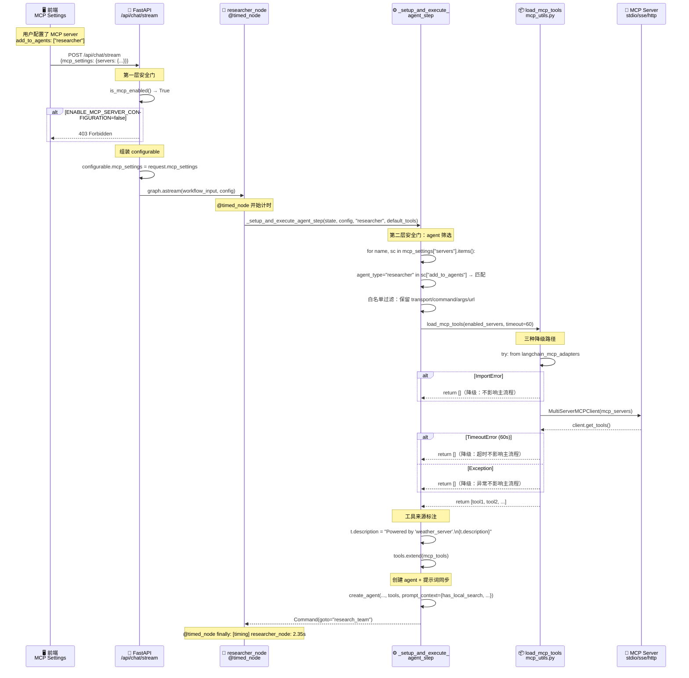
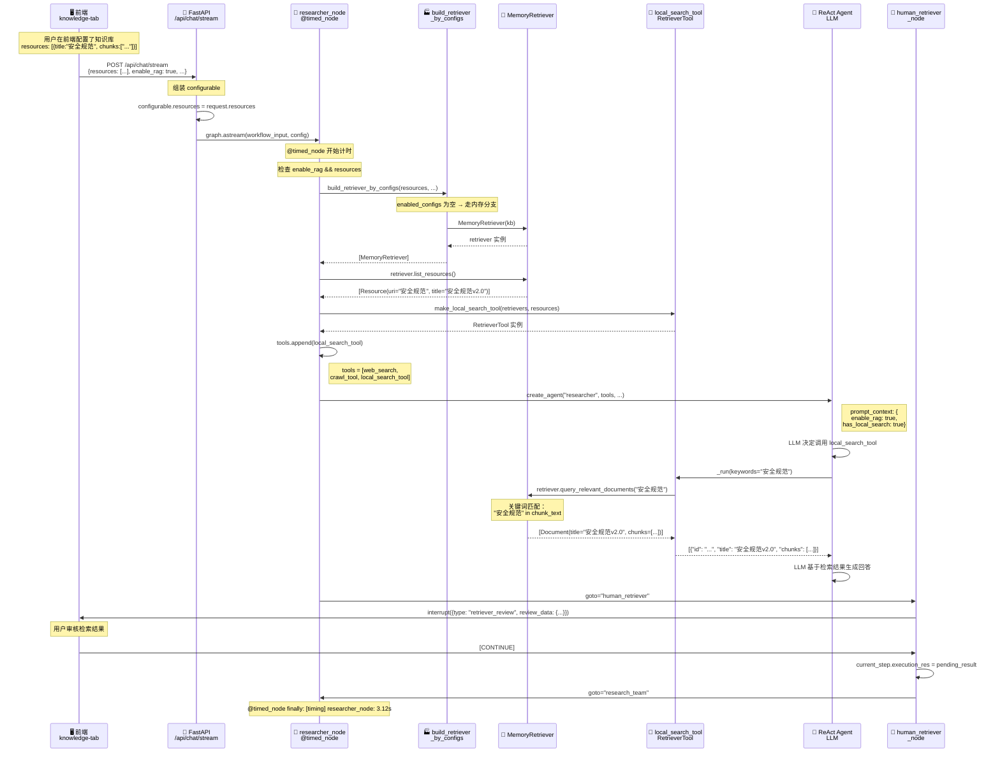

# Chapter-10 深度研究系统 — 调用链全解析

## 一、章节定位：从"能跑"到"可解释、可扩展、可检索"

第9章打通了前后端协作——对话历史可回看、HITL可审核、skip可跳过。但"接口已经存在"不等于"交互已经可信"。本章在第9章基座上叠加**三个横切能力**：

```
第9章基座（SSE + HITL + skip + 回放）
        │
        ├── 增量① 可观测健壮性 ── @timed_node + CB-2 连接池 + LLM 超时
        │       → 每个节点耗时可见、数据库有等待边界、LLM 调用不卡死
        │
        ├── 增量② MCP 动态工具 ── 三层 transport + 限时加载 + 双层安全门
        │       → 新工具上线不用改代码、加载失败不影响主流程、默认关闭防未授权
        │
        └── 增量③ RAG 私有检索 ── Retriever 抽象 + 内存 provider + 6 端点管理
                → 私有知识库可检索、provider 可插拔、前端可配置 CRUD
```

> **与第9章的关系**：第9章的 SSE 协议、skip 控制、回放机制全部保留。本章新增的是**横切能力**——在请求流经图节点的过程中，增加计时、外部工具和知识检索三层。

---

## 二、功能1：可观测健壮性 — @timed_node + 连接池 + LLM超时

### 2.0 调用链概览

> **可观测健壮性总调用链**：
> `@timed_node` 装饰节点 → `time.perf_counter()` 计时 → `finally` 块保证异常也记录 → `logger.info([timing] ...)` 输出耗时
>
> **数据库连接池调用链**：
> `create_engine` → `pool_size=10` + `pool_pre_ping=True` → `connect_args={"connect_timeout":10, "options":"-c statement_timeout=30000"}` → `SessionLocal().execute()`
>
> **LLM 超时调用链**：
> `get_llm_by_type` → `merged.setdefault("timeout", 60)` → `ChatOpenAI(timeout=60, max_retries=3)`

### 2.1 @timed_node 装饰器 — 横切统计节点耗时

**代码位置：** [utils/timing.py](file:///d:/code/python-code/DeepResearch/chapter-10/utils/timing.py)

```python
def timed_node(func: Callable) -> Callable:
    """装饰 graph 节点（sync 或 async），统计执行耗时并记录日志。"""

    @functools.wraps(func)
    async def _async_wrapper(*args, **kwargs):
        start = time.perf_counter()
        try:
            return await func(*args, **kwargs)
        finally:
            logger.info(f"[timing] {func.__name__}: {time.perf_counter() - start:.2f}s")

    @functools.wraps(func)
    def _sync_wrapper(*args, **kwargs):
        start = time.perf_counter()
        try:
            return func(*args, **kwargs)
        finally:
            logger.info(f"[timing] {func.__name__}: {time.perf_counter() - start:.2f}s")

    return _async_wrapper if asyncio.iscoroutinefunction(func) else _sync_wrapper
```

**这段代码在干什么：**

1. 用 `asyncio.iscoroutinefunction(func)` 判断原函数是同步还是异步
2. 两种包装器逻辑完全一致：`time.perf_counter()` 记录开始时间 → 执行原函数 → `finally` 块中计算耗时并打日志
3. `finally` 保证**即使节点抛异常，耗时也会被记录**（这是关键设计：异常节点正是我们需要定位的慢节点）

> **为什么用 `time.perf_counter()` 而不是 `time.time()`？**
>
> `perf_counter()` 是单调时钟，不受系统时间调整影响，精度更高（纳秒级）。`time.time()` 是挂钟时间，可能因 NTP 校时/用户改时间而跳变，不适合做精确耗时测量。

```
执行前（第9章，无耗时观测）：
┌──────────────────────────────────────────────────┐
│ 研究执行过程中卡住了，但日志里看不出哪个节点慢       │
│ 日志输出：                                        │
│   [researcher] ReAct 执行步骤: "光速测量"          │
│   [researcher] 搜索成功，共 3 条结果               │
│                                                  │
│ 问题：researcher 从开始到结束花了多久？不知道。      │
└──────────────────────────────────────────────────┘

执行后（第10章，@timed_node 观测）：
┌──────────────────────────────────────────────────┐
│ 日志输出：                                        │
│   [timing] researcher_node: 2.35s                │
│   [timing] coder_node: 0.12s                     │
│   [timing] reporter_node: 1.08s                  │
│   [timing] eval_node: 3.21s       ← 慢节点定位！  │
│                                                  │
│ 一眼看出 eval_node 耗时最长，可针对性优化。         │
└──────────────────────────────────────────────────┘
```

**在节点上的使用方式：**

```python
# graph/nodes.py:810-811
@timed_node                          # ⭐ 装饰器在最外层
async def researcher_node(state: State, config) -> Command:
    ...

# graph/nodes.py:864-865
@timed_node
async def coder_node(state: State, config) -> Command:
    ...

# graph/nodes.py:876-877
@timed_node
async def reporter_node(state: State, config) -> dict:
    ...
```

> **注意装饰器顺序**：`@timed_node` 必须在最外层。LangGraph 的 `add_node` 会直接调用节点函数，如果 `@timed_node` 在里层，图调用的是内层函数，装饰器就不生效了。

### 2.2 CB-2 连接池加固 — `statement_timeout` + `connect_timeout`

**代码位置：** [database/base.py](file:///d:/code/python-code/DeepResearch/chapter-10/database/base.py)

```
执行前（第9章 CB-1，最小配）：
┌──────────────────────────────────────────────────┐
│ engine = create_engine(DATABASE_URL)              │
│   → 无连接池参数，默认连接数不限制                  │
│   → 无 connect_timeout，建连可能无限等待            │
│   → 无 statement_timeout，慢查询可能永久阻塞         │
│                                                  │
│ 问题：高并发时连接数爆炸；慢 SQL 卡住整个连接池。    │
└──────────────────────────────────────────────────┘

执行后（第10章 CB-2，加固版）：
┌──────────────────────────────────────────────────┐
│ engine = create_engine(                           │
│     DATABASE_URL,                                 │
│     pool_size=10,           # 常驻连接数           │
│     max_overflow=20,        # 突发可溢出 20 个     │
│     pool_recycle=3600,      # 1小时回收连接        │
│     pool_pre_ping=True,     # 用前 ping 一下防断连 │
│     connect_args={                                │
│         "connect_timeout": 10,         # 建连 10s 超时 │
│         "options": "-c statement_timeout=30000",  # SQL 执行 30s 熔断 │
│     },                                            │
│ )                                                 │
└──────────────────────────────────────────────────┘
```

**各参数的作用：**

| 参数 | 值 | 含义 | 为什么重要 |
|------|-----|------|-----------|
| `pool_size` | 10 | 常驻连接数 | 控制基础连接开销，避免无限创建连接耗尽 PG 资源 |
| `max_overflow` | 20 | 突发可溢出 | 高峰期允许临时多开 20 个连接（总共 ≤30） |
| `pool_recycle` | 3600s | 连接回收时间 | 1小时后强制回收，防止 PG 端主动断开后连接池还持有僵尸连接 |
| `pool_pre_ping` | True | 连接前 ping | 取连接时先 `SELECT 1`，确认连接还活着再使用 |
| `connect_timeout` | 10s | 建连超时 | 网络不通时 10s 就报错，不无限等待 |
| `statement_timeout` | 30000ms | SQL 执行超时 | 单条 SQL 超过 30s 自动熔断，防止慢查询阻塞整个连接池 |

> **知识点展开：PG MVCC 为何天然读写并发，不需要 SQLite 的 WAL 补丁？**
>
> SQLite 默认是串行写（写操作会锁整个数据库），WAL（Write-Ahead Logging）模式允许读和写同时进行，是 SQLite 的"并发补丁"。PostgreSQL 使用 MVCC（多版本并发控制），每个事务看到的是数据的快照版本，读不阻塞写、写不阻塞读，**天生支持并发**。因此 SQLite 需要显式开启 WAL 模式才能并发，而 PG 不需要任何补丁。

### 2.3 LLM 超时 — `timeout=60s` + `max_retries=3`

**代码位置：** [llm.py](file:///d:/code/python-code/DeepResearch/chapter-10/llm.py)（第78-81行）

```python
# 默认重试 3 次，处理限流
merged.setdefault("max_retries", 3)
# 本章可观测增量：LLM 调用超时 60s（防卡死；生产按模型调）
merged.setdefault("timeout", int(os.getenv("LLM_TIMEOUT", "60")))
```

**这段代码在干什么：**

在 `get_llm_by_type` 创建 `ChatOpenAI` 实例时，用 `setdefault` 设置两个默认值：
- `timeout=60`：单次 LLM 调用 60s 超时，`LLM_TIMEOUT` 环境变量可覆盖
- `max_retries=3`：失败后自动重试 3 次（处理 API 限流 429）

```
执行前（第9章，无超时）：
┌──────────────────────────────────────────────────┐
│ LLM API 挂了，请求一直 pending                     │
│   → 图节点卡住，整个研究流程中断                    │
│   → 用户看到前端一直转圈，不知道发生了什么           │
└──────────────────────────────────────────────────┘

执行后（第10章，60s 超时 + 3次重试）：
┌──────────────────────────────────────────────────┐
│ 第1次调用：60s 超时 → 重试                         │
│ 第2次调用：60s 超时 → 重试                         │
│ 第3次调用：60s 超时 → 抛出异常                      │
│   → 前端收到 error 事件，显示"LLM 调用超时"         │
│   → 而不是无限等待                                 │
└──────────────────────────────────────────────────┘
```

### 2.4 可观测健壮性：调用链回顾

| 层级 | 函数 | 职责 | 关键设计 |
|------|------|------|----------|
| 装饰器 | `timed_node` | 横切统计节点耗时 | `finally` 保证异常也记录；`perf_counter()` 单调时钟 |
| 数据库 | `create_engine` | 连接池 + 超时边界 | CB-2 六参数；`statement_timeout` 防慢查询；`pool_pre_ping` 防断连 |
| LLM | `get_llm_by_type` | 模型实例创建 | `timeout=60s` + `max_retries=3` + 环境变量可覆盖 |
| 节点 | `researcher_node` 等 | 业务逻辑 | `@timed_node` 在最外层装饰 |

---

## 三、功能2：MCP 动态工具 — 三层 transport + 双层安全门

### 3.0 调用链概览

> **MCP 工具加载总调用链**：
> `researcher_node` → `_setup_and_execute_agent_step` → 过滤 `mcp_settings.servers`（按 `add_to_agents` + `enabled_tools`）→ `load_mcp_tools(enabled_servers)` → `MultiServerMCPClient(mcp_servers)` → `asyncio.wait_for(client.get_tools(), timeout=60)` → 工具注入 `tools.extend(mcp_tools)` → `create_agent` → `_execute_agent_step`
>
> **MCP 安全门调用链**：
> `chat_stream` 端点 → `is_mcp_enabled()` 检查环境变量 → `False` → `HTTP 403`（拒绝请求）
>
> **MCP 预览调用链**：
> `POST /api/mcp/server/metadata` → `is_mcp_enabled()` → 白名单过滤字段 → `load_mcp_tools({"preview": ...}, timeout=15)` → 返回 `{tools, transport, command, ...}`

### 3.1 问题：工具写死在节点里，新工具上线要改代码

```
第9章：
┌──────────────────────────────────────────────────┐
│ researcher 的工具列表：                            │
│   tools = [web_search, crawl_tool, python_repl]   │
│                                                  │
│ 想加一个新工具（如查天气API）：                      │
│   → 需要改代码、写新工具函数、重新部署               │
│   → 每次加工具都要走完整的发布流程                   │
│                                                  │
│ 问题：工具和业务代码耦合，扩展性差。                  │
└──────────────────────────────────────────────────┘
```

### 3.2 双层安全门：默认关闭 + agent 筛选

**代码位置：** [server/mcp_utils.py](file:///d:/code/python-code/DeepResearch/chapter-10/server/mcp_utils.py)（第63-68行）、[server/app.py](file:///d:/code/python-code/DeepResearch/chapter-10/server/app.py)（第99-104行）

```python
# mcp_utils.py:63-68 — 第一层：全局开关
def is_mcp_enabled() -> bool:
    """ENABLE_MCP_SERVER_CONFIGURATION 双层校验（默认关）。"""
    return os.getenv("ENABLE_MCP_SERVER_CONFIGURATION", "false").lower() in (
        "true", "1", "yes", "on",
    )
```

```python
# app.py:99-104 — 端点层校验
@app.post("/api/chat/stream")
async def chat_stream(request: ChatRequest):
    # 本章 MCP 增量：安全开关（默认关，避免任意命令执行风险）
    if request.mcp_settings and not is_mcp_enabled():
        raise HTTPException(
            status_code=403,
            detail="MCP 未启用，设 ENABLE_MCP_SERVER_CONFIGURATION=true",
        )
```

```python
# nodes.py:769-776 — 第二层：agent 筛选
for name, sc in mcp_settings["servers"].items():
    if sc.get("enabled_tools") and agent_type in sc.get("add_to_agents", []):
        enabled_servers[name] = {
            k: v for k, v in sc.items()
            if k in ("transport", "command", "args", "url", "env", "headers")
        }
```

**这段代码在干什么：**

MCP 的安全设计是**双层门**：

```
第一层（全局开关）：
┌──────────────────────────────────────────────────┐
│ ENABLE_MCP_SERVER_CONFIGURATION=false（默认）      │
│   → 所有 MCP 请求直接 403                          │
│   → 即使前端传了 mcp_settings，后端也不处理         │
│                                                  │
│ 原因：MCP（尤其 stdio transport）可以执行任意命令，  │
│ 必须默认关闭，由运维手动开启。                       │
└──────────────────────────────────────────────────┘

第二层（agent 筛选）：
┌──────────────────────────────────────────────────┐
│ 每个 MCP server 配置了 add_to_agents 字段：         │
│   server_A: { add_to_agents: ["researcher"] }     │
│   server_B: { add_to_agents: ["coder"] }          │
│                                                  │
│ researcher 节点：只加载 server_A 的工具             │
│ coder 节点：只加载 server_B 的工具                  │
│                                                  │
│ 原因：不同 agent 有不同的职责，需要不同的工具集。     │
│ 比如 coder 不应该拿到查天气的工具。                  │
└──────────────────────────────────────────────────┘
```

### 3.3 `load_mcp_tools` — 限时可降级加载

**代码位置：** [server/mcp_utils.py](file:///d:/code/python-code/DeepResearch/chapter-10/server/mcp_utils.py)（第18-59行）

```python
async def load_mcp_tools(mcp_servers: dict, timeout_seconds: int = 60) -> list:
    if not mcp_servers:
        return []

    try:
        from langchain_mcp_adapters.client import MultiServerMCPClient
    except ImportError:
        logger.warning("[mcp] langchain-mcp-adapters 未安装，跳过 MCP 工具加载")
        return []

    try:
        client = MultiServerMCPClient(mcp_servers)
        tools = await asyncio.wait_for(client.get_tools(), timeout=timeout_seconds)
        logger.info(f"[mcp] 从 {len(mcp_servers)} 个 MCP server 加载 {len(tools)} 个工具")
        return tools
    except TimeoutError:
        logger.error(f"[mcp] 加载 MCP 工具超时（{timeout_seconds}s）")
        return []
    except Exception as e:
        logger.error(f"[mcp] 加载 MCP 工具失败（不影响主流程）: {e}")
        return []
```

**这段代码在干什么：**

```
执行前（MCP server 正常）：
┌──────────────────────────────────────────────────┐
│ mcp_servers = {"weather": {transport: "stdio",    │
│                command: "python", args: ["-m",    │
│                "weather_mcp_server"]}}            │
│                                                  │
│ → MultiServerMCPClient 启动子进程                  │
│ → asyncio.wait_for 等待工具列表（最多60s）          │
│ → 返回 [get_weather_tool, get_forecast_tool]      │
│ → 注入到 researcher 的工具列表                     │
└──────────────────────────────────────────────────┘

执行过程（MCP server 挂了）：
┌──────────────────────────────────────────────────┐
│ 降级路径1：langchain-mcp-adapters 没装             │
│   → ImportError → return []（不影响主流程）        │
│                                                  │
│ 降级路径2：MCP server 启动超时（60s）              │
│   → TimeoutError → return []                     │
│                                                  │
│ 降级路径3：MCP server 其他异常                     │
│   → Exception → return []                        │
│                                                  │
│ 关键设计：所有失败都返回空列表，research 流程不受影响 │
│ 只是少了一个工具，不会让整个研究中断                 │
└──────────────────────────────────────────────────┘
```

> **三种 Transport 对比：**
>
> | Transport | 通信方式 | 适用场景 | 安全风险 |
> |-----------|----------|----------|----------|
> | `stdio` | 子进程 stdin/stdout | 本地工具，如 Python 脚本 | **最高**：可执行任意命令 |
> | `sse` | HTTP SSE 长连接 | 远程工具服务 | 中：需网络可达 |
> | `streamable_http` | HTTP 请求/响应 | 无状态远程工具 | 低：每次独立请求 |

### 3.4 `_setup_and_execute_agent_step` — MCP 工具注入点

**代码位置：** [graph/nodes.py](file:///d:/code/python-code/DeepResearch/chapter-10/graph/nodes.py)（第762-807行）

```python
async def _setup_and_execute_agent_step(state, config, agent_type, default_tools) -> Command:
    tools = list(default_tools)  # 浅拷贝，防污染默认工具列表

    # 本章 MCP 增量：动态工具加载
    mcp_settings = configurable.mcp_settings if configurable else None
    if mcp_settings and isinstance(mcp_settings, dict) and mcp_settings.get("servers"):
        enabled_servers = {}
        for name, sc in mcp_settings["servers"].items():
            if sc.get("enabled_tools") and agent_type in sc.get("add_to_agents", []):
                enabled_servers[name] = {
                    k: v for k, v in sc.items()
                    if k in ("transport", "command", "args", "url", "env", "headers")
                }  # ⭐ 白名单过滤：只保留启动参数，拒绝 name/enabled_tools 等额外字段
        if enabled_servers:
            mcp_tools = await load_mcp_tools(enabled_servers)
            for t in mcp_tools:
                src = next((n for n, s in enabled_servers.items()
                            if t.name in s.get("enabled_tools", [])), "mcp")
                t.description = f"Powered by '{src}'.\n{t.description}"  # ⭐ 来源标注
            tools.extend(mcp_tools)

    # 提示词同步：agent 看到正确的工具描述
    agent = create_agent(agent_type, agent_type, tools, agent_type, pre_model_hook,
        prompt_context={
            "enable_web_search": configurable.enable_web_search,
            "enable_rag": configurable.enable_rag,
            "has_local_search": "local_search_tool" in tool_names,
        })
    return await _execute_agent_step(state, agent, agent_type, config)
```

**这段代码在干什么：**

1. 从 `configurable.mcp_settings` 读取 MCP 配置
2. 按 `add_to_agents` 筛选：只有当前 agent 类型在 `add_to_agents` 列表中的 server 才加载
3. 白名单过滤：只保留 `transport/command/args/url/env/headers` 等启动参数，拒绝 `name/enabled_tools` 等额外字段（防止传给 `MultiServerMCPClient` 时 TypeError）
4. 调用 `load_mcp_tools` 加载工具，失败返回空列表
5. 给每个 MCP 工具标注来源：`Powered by '<server_name>'.\n{t.description}`（便于审计和调试）
6. 工具注入到 agent 的 `tools` 列表，同时更新 `prompt_context` 让 LLM 知道有哪些工具可用

### 3.5 `mcp_server_metadata` — 预览端点

**代码位置：** [server/app.py](file:///d:/code/python-code/DeepResearch/chapter-10/server/app.py)（第627-661行）

```python
@app.post("/api/mcp/server/metadata")
async def mcp_server_metadata(payload: dict):
    if not is_mcp_enabled():
        raise HTTPException(status_code=403, detail="MCP 未启用")
    # 白名单过滤：只保留启动参数
    connection = {
        k: v for k, v in payload.items()
        if k in ("transport", "command", "args", "url", "env", "headers") and v is not None
    }
    tools = await load_mcp_tools({"preview": connection}, timeout_seconds=15)
    return {
        "transport": payload.get("transport"),
        "command": payload.get("command"),
        ...
        "tools": [{"name": getattr(tool, "name", ...),
                    "description": getattr(tool, "description", "")}
                   for tool in tools],
        "prompts": [],
    }
```

**这段代码在干什么：**

前端在添加 MCP server 时，先调这个端点做**预览**：用 15s 超时尝试连接，返回 server 提供的工具列表。这样用户在保存配置前就能看到这个 MCP server 有哪些工具可用，不需要等实际研究时才报错。

> **为什么预览用 15s 而实际加载用 60s？** 预览是用户交互场景，需要快速反馈；实际加载是后台研究流程，可以等更久。

### 3.6 MCP 端到端时序图



### 3.7 MCP：调用链回顾

| 层级 | 函数 | 职责 | 关键设计 |
|------|------|------|----------|
| 安全门1 | `is_mcp_enabled` | 全局开关 | 默认 `false`；环境变量 `ENABLE_MCP_SERVER_CONFIGURATION` |
| 安全门2 | `_setup_and_execute_agent_step` | agent 筛选 | 按 `add_to_agents` 过滤；白名单过滤启动参数 |
| 加载器 | `load_mcp_tools` | 限时加载 + 降级 | `asyncio.wait_for` 60s 超时；ImportError/TimeoutError/all Exception → 返回 `[]` |
| 注入 | `_setup_and_execute_agent_step` | 工具注入 + 来源标注 | `tools.extend(mcp_tools)`；`description` 加 `Powered by` 前缀 |
| 预览 | `mcp_server_metadata` | 前端预览工具列表 | 15s 超时；白名单字段过滤；返回 `{tools, transport, ...}` |

---

## 四、功能3：RAG 私有知识检索 — Retriever 抽象 + 6端点

### 4.0 调用链概览

> **RAG 检索总调用链**：
> `researcher_node` → `enable_rag` 开关检查 → `build_retriever_by_configs`（资源/平台配置 → MemoryRetriever/AIHubProvider）→ `make_local_search_tool(retrievers, resources)` → `tools.append(local_search_tool)` → `_setup_and_execute_agent_step` → agent 调用 `local_search_tool` → `RetrieverTool._run(keywords)` → `retriever.query_relevant_documents(keywords)` → `MemoryRetriever.query_relevant_documents` → 返回 `[Document.to_dict()]` → 前端 `RetrieverToolCall` 组件渲染
>
> **RAG 配置管理调用链**：
> `GET /api/config/rag/get_config` → `rag_config_service.list_configs(db)` → `repository.list_rag_configs(db)` → `SELECT * FROM rag_configs`
>
> **人工审核调用链**：
> `human_retriever_node` → `interrupt({type: "retriever_review"})` → 前端审核 → `[CONTINUE]` → 提交检索结果 → `goto="research_team"`

### 4.1 问题：只有公网搜索，组织内部规则进不了回答

```
第9章：
┌──────────────────────────────────────────────────┐
│ researcher 只有 web_search 和 crawl_tool：         │
│   → 问"公司内部安全规范是什么？"                     │
│   → web_search 搜不到（内部文档不在公网）            │
│   → LLM 只能瞎编或说不知道                          │
│                                                  │
│ 问题：私有知识无法参与研究流程。                      │
└──────────────────────────────────────────────────┘
```

### 4.2 Retriever 抽象层 — 开闭原则

**代码位置：** [rag/retriever.py](file:///d:/code/python-code/DeepResearch/chapter-10/rag/retriever.py)

```python
class Retriever(abc.ABC):
    """RAG provider 抽象：list_resources + query_relevant_documents。
    实现这两个方法即为一个 provider（ES/RAGFlow/内存/…），开闭原则。
    """
    rag_platform_id: str = ""

    @abc.abstractmethod
    def list_resources(self, query: str | None = None) -> list[Resource]:
        """列出知识库资源。"""

    @abc.abstractmethod
    def query_relevant_documents(
        self, query: str, resources: list[Resource] | None = None
    ) -> list[Document]:
        """检索相关文档。"""
```

**这段代码在干什么：**

`Retriever` 是一个抽象基类（ABC），定义了 RAG provider 的契约：只需要实现两个方法就能成为一个 provider：

- `list_resources`：列出可用知识库资源（如"公司安全规范 v2.0"）
- `query_relevant_documents`：根据查询词检索相关文档片段

```
开闭原则体现：
┌──────────────────────────────────────────────────┐
│ 对扩展开放：想接入新 provider（如 Elasticsearch）    │
│   → 只需继承 Retriever，实现两个方法                │
│   → 不需要改 researcher_node 的代码                │
│                                                  │
│ 对修改关闭：build_retriever_by_configs 工厂按配置   │
│   选择 provider，不需要修改调用方代码                │
└──────────────────────────────────────────────────┘
```

**数据模型：**

```python
class Chunk:
    """检索片段：内容 + 相似度。"""
    content: str
    similarity: float = 1.0

class Document:
    """检索文档：id + 标题 + chunks。"""
    id: str
    title: str
    url: str | None
    chunks: list[Chunk]
    resource_title: str      # 前端显示"来源：XXX"
    rag_platform_id: str     # 前端多 provider 场景的归属标记

    def to_dict(self) -> dict:
        return {
            "id": self.id, "title": self.title,
            "content": "\n\n".join(c.content for c in self.chunks),
            "resource_title": self.resource_title,
            "rag_platform_id": self.rag_platform_id,
            "chunks": [{"content": c.content, "similarity": c.similarity}
                       for c in self.chunks],
        }
```

> **为什么 `to_dict()` 返回这种格式？**
>
> 前端 `RetrieverToolCall` 组件需要 `resource_title` 显示"来源：XXX"，需要 `chunks` 数组在 ContentDialog 里逐 chunk 展示 + 相似度分，需要 `rag_platform_id` 作为多 provider 场景下的归属标记。缺任一都会让检索结果卡片信息不全。

### 4.3 MemoryRetriever — 教学版 provider

**代码位置：** [rag/memory.py](file:///d:/code/python-code/DeepResearch/chapter-10/rag/memory.py)

```python
class MemoryRetriever(Retriever):
    """内存检索器：从内存 dict 中检索知识库片段。"""

    def __init__(self, kb: dict[str, dict]):
        self.kb = kb  # {uri: {title, desc, chunks}}

    def list_resources(self, query=None) -> list[Resource]:
        return [Resource(uri=uri, title=info.get("title", uri), ...)
                for uri, info in self.kb.items()]

    def query_relevant_documents(self, query, resources=None) -> list[Document]:
        docs = []
        for uri, info in self.kb.items():
            for chunk_text in info.get("chunks", []):
                if query.lower() in chunk_text.lower():  # 简单关键词匹配
                    docs.append(Document(
                        id=uri, title=info.get("title", ""),
                        chunks=[Chunk(content=chunk_text, similarity=0.85)],
                        resource_title=info.get("title", ""),
                    ))
        return docs
```

**这段代码在干什么：**

`MemoryRetriever` 是教学版的最简实现：把知识库数据存在内存 dict 里，用**关键词匹配**做检索（不是向量检索）。生产环境可以替换为 Elasticsearch 或向量数据库的 provider，接口不变。

### 4.4 `build_retriever_by_configs` — 工厂方法

**代码位置：** [rag/builder.py](file:///d:/code/python-code/DeepResearch/chapter-10/rag/builder.py)

```python
def build_retriever_by_configs(
    resources: list[dict] | None = None,
    enabled_configs: list[dict] | None = None,
    similarity: float = 0.4,
    ...
) -> list[Retriever]:
    # 分支1：平台配置（aihub 等）
    if enabled_configs:
        retrievers = []
        for config in enabled_configs:
            platform = config.get("platform", "")
            if platform == "aihub":
                from rag.aihub import AIHubProvider
                retrievers.append(AIHubProvider(
                    rag_platform_id=config.get("rag_platform_id", ""),
                    api_url=config.get("api_url", ""),
                    ...
                ))
        return retrievers

    # 分支2：内存格式（教学主线）
    if not resources:
        return []
    from rag.memory import MemoryRetriever
    kb = {}
    for r in resources:
        uri = r.get("uri") or r.get("title") or ""
        kb[uri] = {"title": r.get("title", uri), "desc": r.get("desc", ""),
                   "chunks": r.get("chunks", []) or []}
    return [MemoryRetriever(kb)] if kb else []
```

**这段代码在干什么：**

工厂方法根据配置来源选择 provider：
- `enabled_configs` 非空 → 平台配置（如 aihub），按 `platform` 字段选择具体 provider 类
- `enabled_configs` 为空 → 内存格式，从 `resources` 列表构建 `MemoryRetriever`

### 4.5 `RetrieverTool` — LangChain 工具封装

**代码位置：** [tools/retriever.py](file:///d:/code/python-code/DeepResearch/chapter-10/tools/retriever.py)

```python
class RetrieverTool(BaseTool):
    """local_search_tool：检索私有知识库。"""
    name: str = "local_search_tool"
    description: str = (
        "Useful for retrieving information from the file with `rag://` uri prefix, "
        "it should be higher priority than the web search or writing code. "
        "Input should be a search keywords."
    )
    args_schema: type = _LocalSearchInput
    retrievers: list[Any] = Field(default_factory=list)
    resources: list = Field(default_factory=list)

    def _run(self, keywords: str, **kwargs) -> list[dict]:
        if not self.retrievers:
            return []  # 空列表：LLM 看到空结果会自主转向 web_search
        docs = []
        for retriever in self.retrievers:
            docs.extend(retriever.query_relevant_documents(keywords, self.resources))
        return [d.to_dict() for d in docs]  # 返回 list[dict]，不是 markdown
```

**关键设计：**

- **返回 `list[dict]` 而不是 markdown 字符串**：前端 `RetrieverToolCall` 组件用 `parseJSON` 消费，需要 JSON 数组格式
- **参数名用 `keywords`**：前端 `KeywordsList` 组件读的就是 `toolCall.args.keywords`
- **description 提示 LLM 优先调用本地检索**：`"it should be higher priority than the web search"`
- **空列表即降级**：本地无结果时 LLM 看到空列表会自主转向 `web_search`（RAG-web 协同）

### 4.6 `researcher_node` RAG 注入

**代码位置：** [graph/nodes.py](file:///d:/code/python-code/DeepResearch/chapter-10/graph/nodes.py)（第810-861行）

```python
@timed_node
async def researcher_node(state: State, config) -> Command:
    configurable = Configuration.from_config(config)
    tools = []

    # 第4章：Web 搜索工具
    if configurable.enable_web_search:
        tools.extend([get_web_search_tool(max_results=configurable.max_search_results),
                      crawl_tool])

    # 本章 RAG 增量：配置 resources/rag_configs 时加 local_search_tool
    if configurable.enable_rag and (configurable.resources or configurable.rag_configs):
        retrievers = build_retriever_by_configs(
            configurable.resources,
            enabled_configs=configurable.rag_configs,
            similarity=float(...),
            retriever_keyword=...,
            override_similarity=...,
        )
        if retrievers:
            resources = [resource for retriever in retrievers
                         for resource in retriever.list_resources()]
            tools.append(make_local_search_tool(retrievers, resources))

    return await _setup_and_execute_agent_step(state, config, "researcher", tools)
```

**这段代码在干什么：**

1. 检查 `enable_rag` 开关和资源/配置是否存在
2. 调用 `build_retriever_by_configs` 构建 Retriever 列表
3. 遍历所有 Retriever 调用 `list_resources()` 列出可用资源
4. 创建 `local_search_tool` 并注入到工具列表
5. 加载失败时 catch 异常并跳过 RAG（不影响主流程）

```
执行前（无 RAG）：
┌──────────────────────────────────────────────────┐
│ researcher tools = [web_search, crawl_tool]       │
│                                                  │
│ LLM 问"公司内部安全规范是什么？"                    │
│   → 只能 web_search，搜不到内部文档                │
│   → 回答："我无法找到公司内部安全规范的相关信息"     │
└──────────────────────────────────────────────────┘

执行后（RAG 注入 local_search_tool）：
┌──────────────────────────────────────────────────┐
│ researcher tools = [web_search, crawl_tool,       │
│                     local_search_tool]            │
│                                                  │
│ LLM 问"公司内部安全规范是什么？"                    │
│   → 优先调用 local_search_tool("安全规范")         │
│   → MemoryRetriever 检索到相关文档片段             │
│   → 返回 [{"title":"安全规范v2.0", "chunks":[...]}]│
│   → LLM 基于检索结果生成回答                       │
│   → 如果本地无结果，LLM 自主转向 web_search         │
└──────────────────────────────────────────────────┘
```

### 4.7 `human_retriever_node` — 人工审核检索结果

**代码位置：** [graph/nodes.py](file:///d:/code/python-code/DeepResearch/chapter-10/graph/nodes.py)（第270-330行）

```python
async def human_retriever_node(state: State, config) -> Command:
    """审核本轮知识库检索结果；接受后提交缓存结果，修改后重新研究。"""
    review_data = state.get("pending_retrieval_review") or {}
    feedback = interrupt({
        "type": "retriever_review",
        "message": "请审核知识库检索结果；可接受并继续，或修改关键词/阈值后重新检索。",
        "re_execute_times": getattr(current_step, "step_iterations", 0),
        "review_data": review_data,
    })

    if feedback and str(feedback).upper().startswith("[CONTINUE]"):
        # 用户接受：提交缓存结果
        current_step.execution_res = pending_result
        return Command(update={"current_plan": current_plan, ...}, goto="research_team")
    # 用户修改：保持缓存，下一轮重新检索
    return Command(update={...}, goto="human_retriever")
```

**这段代码在干什么：**

在 RAG 检索出结果后，不是直接使用，而是通过 `interrupt` 暂停流程，让用户审核：
- `[CONTINUE]` → 接受检索结果，写入 `current_step.execution_res`，继续研究
- 非 `[CONTINUE]` → 用户修改了关键词或阈值，回到 `human_retriever` 重新检索

这是 HITL（Human-in-the-Loop）在 RAG 场景的具体应用。

### 4.8 RAG 配置 API — 六端点 CRUD

**代码位置：** [server/app.py](file:///d:/code/python-code/DeepResearch/chapter-10/server/app.py)（第570-624行）、[server/rag_config_service.py](file:///d:/code/python-code/DeepResearch/chapter-10/server/rag_config_service.py)

| 端点 | 方法 | 功能 | 代码位置 |
|------|------|------|----------|
| `/api/config/rag/get_config` | GET | 列出所有知识库配置 | app.py:570-574 |
| `/api/config/rag/save_config` | POST | 创建知识库配置 | app.py:577-581 |
| `/api/config/rag/{config_id}` | PUT | 更新知识库配置 | app.py:583-588 |
| `/api/config/rag/{config_id}` | DELETE | 删除知识库配置 | app.py:591-593 |
| `/api/config/rag/test_connection` | POST | 测试连接（aihub 走真实连接） | app.py:596-618 |
| `/api/rag/resources` | GET | 查询知识库资源 | app.py:621-623 |

**RAG 配置数据模型：** [server/rag_request.py](file:///d:/code/python-code/DeepResearch/chapter-10/server/rag_request.py)

```python
class RAGConfigPayload(BaseModel):
    name: str = Field(min_length=1)
    platform: str = Field(min_length=1)
    api_url: str = ""
    ext_config: dict[str, Any] = Field(default_factory=dict)
    retrieval_size: int = Field(default=5, ge=1, le=100)
    similarity: float = Field(default=0.5, ge=0.0, le=1.0)
    is_enabled: bool = True
```

```
执行前（第9章，无配置管理）：
┌──────────────────────────────────────────────────┐
│ 知识库配置硬编码在代码里，要改就得改代码重新部署      │
└──────────────────────────────────────────────────┘

执行后（第10章，PG 持久化 + 6端点）：
┌──────────────────────────────────────────────────┐
│ 前端 knowledge-tab 页面：                          │
│   → GET /api/config/rag/get_config → 列出配置列表 │
│   → POST /api/config/rag/save_config → 新增配置   │
│   → PUT /api/config/rag/{id} → 修改配置           │
│   → DELETE /api/config/rag/{id} → 删除配置        │
│   → POST /api/config/rag/test_connection → 测试   │
│   → GET /api/rag/resources?query=xxx → 搜索资源   │
│                                                  │
│ 所有配置持久化到 PostgreSQL rag_configs 表          │
│ 前端修改配置后，下次研究自动使用新配置               │
└──────────────────────────────────────────────────┘
```

**RAGConfigService 的持久化桥接：** [server/rag_config_service.py](file:///d:/code/python-code/DeepResearch/chapter-10/server/rag_config_service.py)

```python
class RAGConfigService:
    """RAG 配置仓库：PG 持久化（接口不变，对齐前端 API 契约）。"""

    def list_configs(self, db: Session) -> list[dict]:
        return repository.list_rag_configs(db)       # → SELECT * FROM rag_configs

    def create(self, db: Session, payload: RAGConfigPayload) -> dict:
        config_id = uuid4().hex
        return repository.create_rag_config(db, config_id, payload.model_dump())

    def update(self, db: Session, config_id: str, changes: dict) -> dict | None:
        return repository.update_rag_config(db, config_id, changes)

    def delete(self, db: Session, config_id: str) -> bool:
        return repository.delete_rag_config(db, config_id)

    def query_resources(self, db: Session, query: str = "") -> list[dict]:
        return repository.query_rag_resources(db, query)
```

### 4.9 RAG 端到端时序图



### 4.10 RAG：调用链回顾

| 层级 | 函数 | 职责 | 关键设计 |
|------|------|------|----------|
| 抽象层 | `Retriever` (ABC) | 定义 provider 契约 | 两个抽象方法：`list_resources` + `query_relevant_documents` |
| 实现层 | `MemoryRetriever` | 内存关键词检索 | 教学版最简实现；生产可替换为 ES/向量数据库 |
| 工厂 | `build_retriever_by_configs` | 按配置选择 provider | 平台配置优先 → 内存格式兜底 |
| 工具 | `RetrieverTool` | LangChain 工具封装 | 返回 `list[dict]`（非 markdown）；空列表即降级 |
| 注入 | `researcher_node` | 动态注入 RAG 工具 | `enable_rag` 开关 + 资源/配置检查 |
| 审核 | `human_retriever_node` | HITL 审核检索结果 | `interrupt` + `[CONTINUE]` 提交 |
| 管理 | 6 端点 | CRUD + 连接测试 + 资源查询 | PG 持久化；`RAGConfigService` 桥接 |

---

## 五、完整调用链回顾

### 一次研究请求的完整路径（三个增量全部叠加后）

```
HTTP 请求 → FastAPI chat_stream
    │
    ├── [安全门] is_mcp_enabled() → 403 if disabled
    │
    ├── [组装 configurable]
    │   ├── mcp_settings → MCP server 配置
    │   ├── resources + rag_configs → RAG 知识库配置
    │   └── enable_rag, enable_web_search, ...
    │
    └── graph.astream(workflow_input, config)
        │
        ├── coordinator_node    ← [timing] coordinator_node: 0.52s
        ├── planner_node        ← [timing] planner_node: 1.23s
        ├── human_feedback_node (HITL)
        │
        ├── research_team_node
        │   └── researcher_node ← [timing] researcher_node: 2.35s
        │       │
        │       ├── [RAG] build_retriever_by_configs → MemoryRetriever
        │       ├── [RAG] make_local_search_tool → tools.append
        │       ├── [MCP] load_mcp_tools → tools.extend
        │       ├── [MCP] MultiServerMCPClient → asyncio.wait_for(60s)
        │       └── _execute_agent_step → agent.astream
        │           │
        │           ├── [DB] SessionLocal() → pool_pre_ping → statement_timeout=30s
        │           └── [LLM] ChatOpenAI(timeout=60, max_retries=3)
        │
        ├── eval_node          ← [timing] eval_node: 3.21s
        ├── reporter_node      ← [timing] reporter_node: 1.08s
        └── SSE 事件流 → 前端渲染
```

### 覆盖的调用链

| 层级 | 函数/模块 | 新增/修改 | 职责 |
|------|-----------|----------|------|
| 装饰器 | `timed_node` | **新增** | 横切统计节点耗时 |
| 数据库 | `create_engine` (CB-2) | 修改 | 连接池 + 超时边界 |
| LLM | `get_llm_by_type` | 修改 | 增加 `timeout=60s` |
| MCP加载 | `load_mcp_tools` | **新增** | 限时加载 + 三层降级 |
| MCP安全 | `is_mcp_enabled` | **新增** | 全局开关 |
| MCP注入 | `_setup_and_execute_agent_step` | 修改 | 按 agent 筛选 + 工具注入 |
| MCP预览 | `mcp_server_metadata` | **新增** | 前端预览工具列表 |
| RAG抽象 | `Retriever` (ABC) | **新增** | provider 契约 |
| RAG内存 | `MemoryRetriever` | **新增** | 教学版 provider |
| RAG工厂 | `build_retriever_by_configs` | **新增** | 按配置选择 provider |
| RAG工具 | `RetrieverTool` | **新增** | LangChain 工具封装 |
| RAG注入 | `researcher_node` | 修改 | 动态注入 RAG 工具 |
| RAG审核 | `human_retriever_node` | **新增** | HITL 审核检索结果 |
| RAG管理 | 6 端点 + `RAGConfigService` | **新增** | CRUD + 连接测试 + 资源查询 |
| 配置 | `Configuration` | 修改 | 新增 `mcp_settings`/`resources`/`rag_configs` 等字段 |
| 状态 | `State` (types.py) | 修改 | 新增 `param_list`/`pending_retrieval_review`/`pending_execution_res` |

---

## 六、关键设计点总结

| 设计点 | 说明 |
|--------|------|
| **横切观测** | `@timed_node` 用 `finally` 保证异常也记录耗时，不侵入业务逻辑 |
| **单调时钟** | `time.perf_counter()` 不受系统时间调整影响，精度更高 |
| **连接池六参数** | CB-2 的 `pool_size`/`max_overflow`/`pool_recycle`/`pool_pre_ping`/`connect_timeout`/`statement_timeout` 覆盖了连接池生命周期的所有边界 |
| **PG MVCC 天然并发** | 读不阻塞写、写不阻塞读，不需要 SQLite 的 WAL 补丁 |
| **LLM 双保险** | `timeout=60s` 防卡死 + `max_retries=3` 防限流，环境变量可覆盖 |
| **MCP 双层安全门** | 第一层全局开关（默认关闭）→ 第二层 agent 筛选（`add_to_agents`），防止未授权工具注入 |
| **MCP 优雅降级** | `load_mcp_tools` 的 ImportError/TimeoutError/Exception 全部返回 `[]`，MCP 失败不破坏主流程 |
| **MCP 工具来源标注** | `description` 加 `Powered by '<server>'` 前缀，便于审计和调试 |
| **MCP 白名单过滤** | 只保留 `transport/command/args/url/env/headers` 启动参数，防止额外字段导致 `MultiServerMCPClient` TypeError |
| **RAG 开闭原则** | `Retriever` 抽象类：新 provider 只需实现两个方法，不需要改调用方代码 |
| **RAG-web 协同** | `local_search_tool` 空结果时 LLM 自主转向 `web_search`，本地和公网无缝切换 |
| **RAG 数据契约** | `Document.to_dict()` 返回的字段专为前端 `RetrieverToolCall` 组件设计，缺任一字段卡片信息不全 |
| **RAG 人工审核** | `human_retriever_node` 用 `interrupt` 暂停流程，用户可修改关键词/阈值后重新检索 |
| **配置持久化** | RAG 配置从硬编码迁移到 PG `rag_configs` 表，6 端点支持完整 CRUD |
| **阈值三级优先级** | 人工修改 > 知识库配置 > 全局默认，`_get_effective_retriever_similarity` 实现 |
| **异步加载** | `load_mcp_tools` 用 `asyncio.wait_for` 限时加载，不阻塞其他请求 |